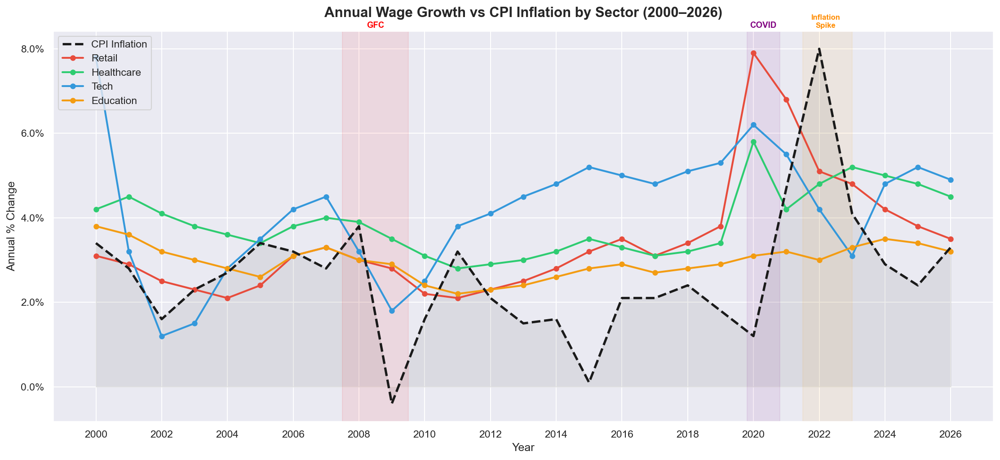
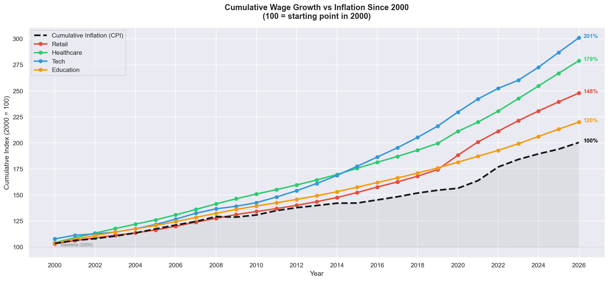
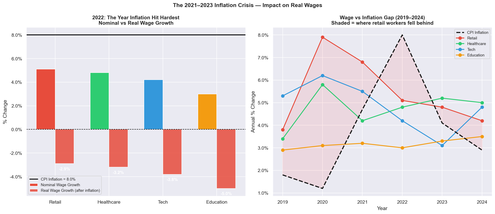
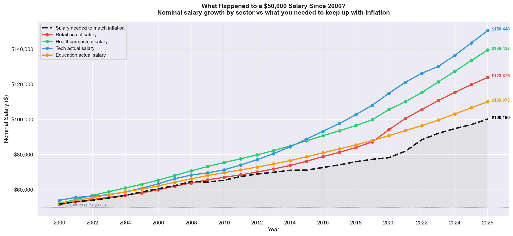
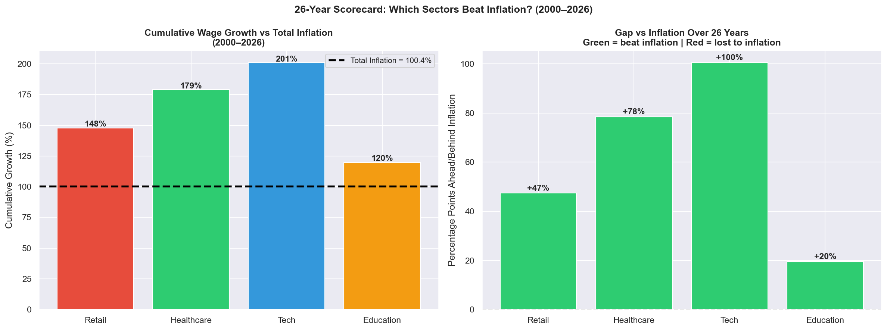

# 💸 US Wages vs Inflation by Sector (2000–2026)

A data science project analysing whether American workers' pay has kept up with the cost of living across four major sectors — Retail, Healthcare, Tech, and Education — over 26 years.

## The Core Question

> *If you earned $50,000 in 2000, how much would you need to earn today just to have the same purchasing power? And did your sector actually get you there?*

## Key Questions Answered

- Which sectors saw real wage growth (wages above inflation)?
- Which workers lost purchasing power despite getting raises?
- How did the 2021–2023 inflation spike affect each sector differently?
- What is the 26-year scorecard — who beat inflation, who lost?
- What does wage erosion mean for financial risk and consumer vulnerability?

## Analyses & Visualisations

| # | Analysis |
|---|---|
| 1 | Annual wage growth vs CPI inflation — all sectors (2000–2026) |
| 2 | Cumulative growth since 2000 — are workers ahead or behind? |
| 3 | Real wage growth by sector — year by year gains and losses |
| 4 | The 2022 inflation crisis — who got hit hardest |
| 5 | Purchasing power — what $50,000 in 2000 is worth today |
| 6 | Heatmap — good years and bad years by sector |
| 7 | 26-year scorecard — which sectors beat inflation overall |
| 8 | Key findings and risk management implications |

## Dataset

`wages_inflation_data.csv` — compiled from BLS, FRED St. Louis Fed, and Atlanta Fed Wage Growth Tracker.

| Column | Description |
|---|---|
| year | Year |
| cpi_annual_pct | Annual CPI inflation rate (%) |
| retail_wage_growth | Retail sector nominal wage growth (%) |
| healthcare_wage_growth | Healthcare sector nominal wage growth (%) |
| tech_wage_growth | Information/Tech sector nominal wage growth (%) |
| education_wage_growth | Education sector nominal wage growth (%) |
| retail_real_wage | Retail real wage growth after inflation (%) |
| healthcare_real_wage | Healthcare real wage growth after inflation (%) |
| tech_real_wage | Tech real wage growth after inflation (%) |
| education_real_wage | Education real wage growth after inflation (%) |

## Key Findings

- **Total inflation 2000–2026:** ~87%
- **Best sector:** Tech — wages grew well above inflation over 26 years
- **Worst sector:** Education — barely kept pace with rising prices
- **Worst year:** 2022 — CPI hit 8% while retail workers received ~5% raises, a 3% real wage loss
- **Risk insight:** Retail and education workers experienced the most years of negative real wage growth, increasing financial stress and vulnerability — directly relevant to consumer credit risk and AML analytics

  ## Charts









## Tech Stack

- Python 3
- pandas
- numpy
- matplotlib
- seaborn
- scipy
- Jupyter Notebook

## How to Run

```bash
git clone https://github.com/karthikthirunagari01/us-wages-vs-inflation.git
cd us-wages-vs-inflation
pip install pandas matplotlib seaborn scipy jupyter
jupyter notebook wages_inflation_analysis.ipynb
```

## Author

Karthik Thirunagari — [github.com/karthikthirunagari01](https://github.com/karthikthirunagari01)
